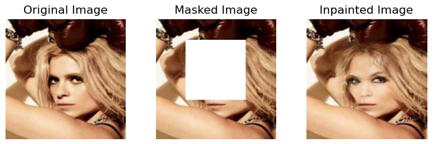

# Image_Inpainting_Using_GANs

## Overview

This project aims at implementing a <a href="https://arxiv.org/abs/1806.03589">DeepFillV2</a> based model for inpainting images using the CelebA dataset. 

## Dataset

Images from the CelebA dataset available <a href="https://www.kaggle.com/datasets/jessicali9530/celeba-dataset">here</a>.  The images are normalized and resized to 256x256.  For this project, only SQUARE masks of size 128x128 are used and are placed in random locations. 

The dataset is then split into training and validation (64 images for validation) with a batch size of 2 for training (due to memory constraints). 

## Model

The discriminator is the same Spectral Markovian Discriminator proposed in the DeepFillV2 paper.  However, the discriminator takes in only the predicted image as input and not the concatenation of the mask and image as done in the paper.  

The generator used is the same as proposed in the paper, except for the contextual attention layer being replaced by a self attention layer as done <a href="https://github.com/avalonstrel/GatedConvolution_pytorch">here</a>.  

## Training

The main difference between the original implementation and this project is in the way the model is trained.  Along with the usual hinge loss for the generator, a reconstruction loss is added (L1 Loss) since it gave better results than without. The weights for reconstruction and hinge loss are 1 and 0.01 respectively.  Also as mentioned, the discriminator only takes in the predicted image as input.  The model was trained for a maximum of 200000 * 30 iterations.

## Results

The results after training for a few epochs varied widely depending on the images as shown below.  Faces which aren't facing directly at the viewer gave poor results probably due to a dataset imbalance.  Also, articles such as glasses and hats were removed after inpainting as desired.  The following samples are taken from the validation set.

### Samples where the model performance was acceptable

## Samples where the model failed

It can be seen that the model doesn't handle elaborate poses and complete face coverage.  Further samples of failed results can be found in the Results folder.  Elaborate facial expressions also seem to be a problem (as can be seen in sample7.png).  These could suggest a bias as mentioned earlier resulting from the imbalance in the dataset.

## Possible Improvements

Due to constraints on compute resources, the model could not be trained for more epochs.  More training could definitely improve results.  In addition, a more careful analysis of the dataset could help in reducing bias towards certain images.  Using different ways of calculating loss could also be done.  Of course other architectures could definitely be used.

## References

-> <a href="https://arxiv.org/abs/1806.03589">Original Paper proposing DeepFillV2</a> 
-> <a href="https://github.com/avalonstrel/GatedConvolution_pytorch">DeepFillV2 with Self Attention</a> 
-> <a href="https://arxiv.org/abs/1805.08318">Paper on Self Attention for GANs</a> 
